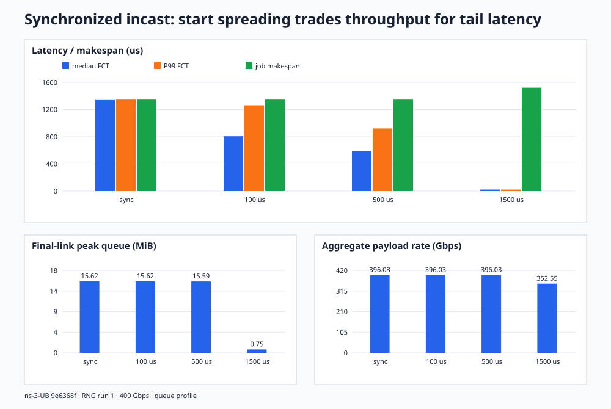
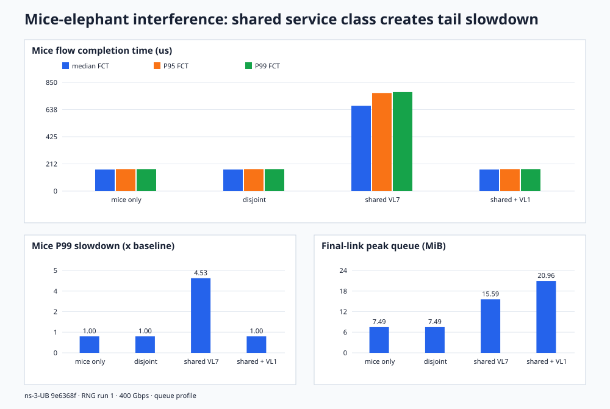
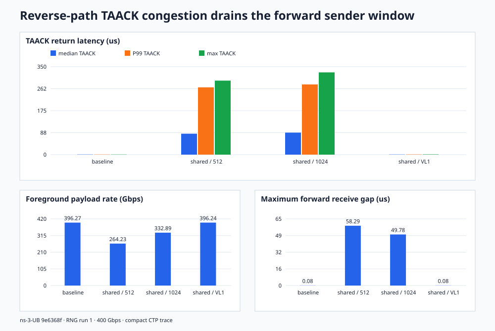

# 网络拥塞场景综合仿真结果报告

## 1. 摘要

本报告在相同的 512-host、4×400 Gbps Clos 和公开版 ns-3-UB/CTP 固定提交 `9e6368f` 上汇总三类常见数据中心网络问题：

1. **同步 incast / 微突发：**64 个源同时向 node128:port0 写入 1 MiB，并用启动时间摊开模拟 admission/pacing；
2. **mice–elephant 干扰：**32 条 256 KiB 延迟敏感短流与 8 条 16 MiB 长流竞争，分别验证路径隔离和 VL 优先级隔离；
3. **反向 TAACK 拥塞：**反向 bulk data 阻塞 CTP TAACK，验证有限 sender window、正向链路空洞和优先级隔离之间的因果关系。

共汇总 12 个 case、520 个已完成任务，其中包含 400 个被观测的前景/业务流和 120 个背景流。所有任务均完成；重传与拥塞控制关闭。本报告观察到的恶化来自无损队列、调度共享、反馈阻塞和同步突发，而不是丢包恢复。

最重要的三个结果是：

- 轻微错峰不足以消除微突发。启动摊开 500 us 时 P99 FCT 下降 31.96%，但峰值队列仍为 15.59 MiB；只有 1.5 ms 的 admission-style pacing 才把峰值队列降至 0.75 MiB、P99 降低 98.32%，代价是作业 makespan 增加 12.33%。
- 长流只有共享同一个最终接收口和 VL 时才伤害短流。短流 P99 从 170.905 us 上升到 773.923 us，即 4.528×；把短流放入 VL1 后 P99 恢复到 171.064 us，但峰值队列反而增至 20.96 MiB。这说明 QoS 能保护业务尾延迟，却不会自动消除底层拥塞和缓冲压力。
- 反向 bulk data 与 TAACK 共享最终回程口和 VL7 后，TAACK P99 从 0.706 us 猛增到 267.905 us、前景带宽下降 33.32%。窗口从 512 加到 1024 只能部分恢复，而 VL1 隔离把前景带宽恢复到 396.24 Gbps，说明根因是反馈路径调度拥塞，有限窗口是放大/传导环节。

## 2. 实验环境与口径

| 项目 | 设置 |
|---|---|
| 仿真器 | open-usim/ns-3-ub `9e6368faaadfeb09d42b474097440020e29ce29c` |
| 拓扑 | 512 hosts、32 L1、16 L2；host 4×400 Gbps；L1–L2 全互联 |
| 路由 | shortest path + packet spray，source 最多 4 个 outport |
| 接收端 | node128，默认 CNA port0；最终交换机出口 node520:port0 |
| 流控/调度 | CBFC、SP |
| CTP | inflight 512、OOO threshold 2048 |
| 可靠性 | retransmission off、congestion control off |
| 观测 | incast/mice 使用 `queue` profile；TAACK 使用 compact + CTP filtered detail trace |
| 随机种子 | RNG run 1 |

FCT 均按每条任务自己的 `taskStartTime` 到 `taskCompletesTime` 计算。`job makespan` 从该 case 最早任务启动到最后任务完成。队列指标来自 node520:port0 的 `QueueTrace`；接收带宽来自 node128:port0 的 `throughput.csv`。

## 3. 模式一：同步 incast 与启动时间摊开

### 3.1 场景设计

64 个源 node0..63 向 node128 写入 1 MiB，VL7，基础启动时间 100 us。四个 case 只改变 64 条流首尾启动时间跨度：0、100、500 和 1500 us。流量总量保持 64 MiB 不变。

该设计对应集合通信同步阶段、参数服务器 fan-in、barrier 后集中提交等场景。控制变量是“并发量进入网络的时间尺度”，不是流量字节数。

### 3.2 完整汇总

| Case | 启动跨度 us | FCT P50 us | FCT P95 us | FCT P99 us | Job makespan us | Payload Gbps | 峰值队列 MiB | 队列≥1 MiB us | 最大接收空洞 us |
|---|---:|---:|---:|---:|---:|---:|---:|---:|---:|
| sync | 0 | 1349.723 | 1355.136 | 1355.632 | 1355.632 | 396.030 | 15.62 | 1331.662 | 0.082640 |
| spread100 | 100 | 807.560 | 1262.329 | 1263.289 | 1355.632 | 396.030 | 15.62 | 1329.265 | 0.082640 |
| spread500 | 500 | 585.082 | 913.094 | 922.438 | 1355.632 | 396.030 | 15.59 | 1322.486 | 0.082640 |
| spread1500 | 1500 | 22.814 | 22.814 | 22.815 | 1522.814 | 352.552 | 0.75 | 0 | 2.736324 |

### 3.3 解释

前 3 个 case 的 job makespan、接收线速和峰值队列几乎不变，说明 0–500 us 仍小于这批数据的瓶颈排空时间。错峰让较晚启动的流少等一部分队列，因此单流 FCT 下降，但并没有真正解除最终出口的持续拥塞。

1 MiB payload 对应 256 个 4096-byte segment；计入每段 36-byte 线缆开销后单流约 1,057,792 bytes，在 400 Gbps 上约需 21.16 us。64 条流若要不持续堆积，相邻启动间隔应接近或大于该序列化时间，即总跨度约 1.33 ms。`spread1500` 的平均间隔约 23.81 us，跨过了这个阈值，所以队列≥1 MiB 的时间从约 1.33 ms 降为 0。

它同时产生一个真实的工程权衡：

- P99 相对同步 case 降低 98.32%；
- 峰值队列降低 95.18%；
- 但 job makespan 增加 12.33%，payload rate 由 396.03 降至 352.55 Gbps；
- 接收最大包间空洞由 0.08264 增至 2.736 us，说明 pacing 已使链路出现短暂空闲。

因此，优化目标不应是“完全摊平”。更合适的 admission span 应靠近 `总 wire bytes / 瓶颈带宽`，并根据尾延迟 SLO 与允许的链路空闲量留出余量。

## 4. 模式二：mice–elephant 干扰

### 4.1 场景设计

前景为 node0..31 到 node128 的 32 条 256 KiB URMA_WRITE，100 us 同步启动。背景为 node256..263 的 8 条 16 MiB 长流，提前在 0 us 启动。四个 case 分别为：无长流、长流去 node192、长流同去 node128 且共享 VL7、共享 node128 但短流改用 VL1。

`elephant-disjoint` 用于区分“一般 fabric 背景负载”和“最终瓶颈/服务类共享”；VL1 case 则只改变调度隔离，不减少任何长流字节数。

### 4.2 完整汇总

| Case | 长流数 | Mice P50 us | P95 us | P99 us | P99 slowdown | Mice Gbps | 峰值队列 MiB | 队列≥1 MiB us | FCT spread us |
|---|---:|---:|---:|---:|---:|---:|---:|---:|---:|
| mice-only | 0 | 168.963 | 170.822 | 170.905 | 1.000× | 392.669 | 7.49 | 146.935 | 9.173 |
| elephant-disjoint | 8 | 168.963 | 170.822 | 170.905 | 1.000× | 392.669 | 7.49 | 146.935 | 9.173 |
| elephant-shared | 8 | 666.532 | 767.312 | 773.923 | 4.528× | 86.713 | 15.59 | 2854.882 | 183.626 |
| elephant-shared-mice-vl1 | 8 | 168.874 | 170.982 | 171.064 | 1.001× | 392.302 | 20.96 | 2853.635 | 12.065 |

### 4.3 解释

`elephant-disjoint` 与 `mice-only` 的所有关键短流指标完全相同，说明仅仅存在 8 条跨 fabric 长流并不会造成该问题。长流必须和短流共享 node128:port0，且处于相同 VL7 服务等级，才出现 4.528× 的 P99 slowdown。

共享 VL7 时，node128 接收口仍保持 400 Gbps、连续数据包最大间隔仍为 0.08264 us，但短流聚合有效带宽降至 86.71 Gbps。也就是说，网络没有欠利用；问题是 400 Gbps 被长流占用，短流在同一服务类内排队。这正是“端口利用率看起来健康，但业务尾延迟严重恶化”的典型场景。

VL1 隔离把短流 P99 恢复到基线的 1.001×，但峰值队列从共享 VL7 的 15.59 MiB 进一步增到 20.96 MiB，队列≥1 MiB 的时间仍约 2.85 ms。SP 调度优先服务短流，相当于把等待转移给 VL7 长流；它保护了短流 SLO，却没有降低总到达负载。

## 5. 模式三：反向 TAACK 拥塞与 sender-window starvation

### 5.1 场景设计

前景为 node0..3 到 node128 的 4 条 32 MiB URMA_WRITE，100 us 启动。干扰 case 增加 32 条反向 bulk flow：node256..287 分别打到 node0..3，每个前景源最终回程口有 8 条背景流，背景总量保持 1 GiB。

四个公开上游复验 case 为：无背景、共享回程口/VL7 且 inflight=512、同样拥塞但 inflight=1024、inflight 恢复 512 但前景及其 TAACK 使用 VL1。TAACK latency 定义为接收端完成 TA unit 到发送端处理对应 TAACK 的时间，每个 case 对 source0 取得 8192 个 TAACK 样本。

### 5.2 完整汇总

| Case | Inflight | FG last ms | FG Gbps | Receiver Gbps | 最大正向空洞 us | TAACK P50 us | P99 us | Max us |
|---|---:|---:|---:|---:|---:|---:|---:|---:|
| no-bg | 512 | 2.709605 | 396.272 | 400.000 | 0.082640 | 0.705920 | 0.705920 | 0.706920 |
| reverse-shared-fanin08 | 512 | 4.063631 | 264.232 | 282.110 | 58.287680 | 83.431800 | 267.905040 | 294.580480 |
| reverse-shared-fanin08-window1024 | 1024 | 3.225528 | 332.889 | 373.670 | 49.781000 | 87.689280 | 279.321520 | 327.420520 |
| reverse-shared-fanin08-fgprio1 | 512 | 2.709824 | 396.240 | 400.000 | 0.082640 | 0.848720 | 1.068240 | 1.154040 |

### 5.3 因果解释

三个对照共同定位了机制：

1. **基线也会短暂达到 inflight 512，但不会欠吞吐。** 此时 TAACK P99 只有 0.706 us，窗口槽位能够快速循环，最大正向包间隔只有 0.08264 us。因此看到 `Inflight reach limit` 本身不等于存在性能问题，关键是窗口保持无法释放的时间。
2. **共享回程口/VL 后才形成反馈饥饿。** TAACK P99 增至基线的 379.5×，最大正向空洞增至 58.29 us，前景带宽下降 33.32%，最晚完成时间增加 49.97%。接收链路明显欠利用，但所有任务仍完成，说明不是丢包恢复。
3. **加窗口只缓解，不治根。** inflight=1024 时 TAACK P99 仍为 279.32 us，甚至略高于 512 case；前景带宽相对拥塞 case 提升 25.98%，但仍比基线低 15.99%。更大的窗口覆盖了更多 feedback BDP，却没有减少 TAACK 排队。
4. **VL 隔离直接消除反馈调度竞争。** 恢复 inflight=512 后，只把前景/TAACK 放到 VL1，TAACK P99 降至 1.068 us、前景带宽恢复 396.24 Gbps、正向空洞恢复 0.08264 us。这证明共享服务等级才是根因，有限窗口是传导环节。

工程上最好让 TAACK 使用独立控制 VL 或获得 WRR reserved share；当前用例将前景 data 和其继承的 TAACK 一起提升到 VL1，只是公开配置接口下的代理实验。单纯扩大 inflight 会增加在途数据和缓冲压力，不应作为唯一方案。

## 6. 综合结论与优化建议

| 问题 | 能看到的症状 | 本实验根因 | 有效措施 | 需要警惕 |
|---|---|---|---|---|
| 同步 incast | 队列约 16 MiB、FCT≈整个批次排空时间 | 同步到达速度远超 400 Gbps 最终出口 | receiver-driven admission、按 wire serialization 做 pacing、启动抖动 | 太强 pacing 会增加 makespan 并制造链路空洞 |
| Mice–elephant HoL | 接收口仍满载，但 mice P99 变成 4.528× | 短流与长流共享最终口和同一 VL 调度 | 独立控制/延迟敏感 VL、WRR 保底、短流感知调度 | SP 可能把队列和延迟转移给低优先级长流 |
| 反向 TAACK 拥塞 | TAACK P99≈268 us、正向空洞≈58 us、前景带宽下降 33% | 反馈与反向 bulk data 共享最终回程口/VL，有限 window 无法及时释放 | TAACK 控制 VL、WRR reserved share、按反馈 BDP 设置 inflight | 只扩大窗口会增加在途量且只能部分恢复 |

建议的实现优先级：

1. 先对 collective/多打一入口做 receiver-driven admission，把同步批次摊到接近瓶颈序列化时间，而不是固定使用一个任意 jitter；
2. 给 TAACK、控制流和真正的 latency-sensitive mice 保留独立服务类或最小带宽，但不要把所有前景 bulk data 都提升为最高优先级；
3. 同时监控业务 FCT 分位数、每 VL 队列时长和端口利用率。只看端口利用率会漏掉 mice–elephant 问题，只看 FCT 又无法区分欠利用与调度排队；
4. 若使用 SP，需要增加低优先级饥饿上限；更稳妥的生产方案通常是带 reserved share 的 WRR/DRR。

## 7. 可信度与边界

- 三类场景各包含 4 个严格控制变量的 case；incast/mice 每个 case 有 32 或 64 条前景流，TAACK 每个 case 有 8192 个 source0 反馈样本，并有 window/QoS 反事实对照。
- 当前只运行 RNG run 1，足以证明机制能够稳定出现，但不能表示生产概率分布。后续应扫描 RNG、非均匀随机启动、流大小分布和更多目的节点。
- 仿真属于包级协议/队列模型，不包含 doorbell/WQE、DMA、PCIe、NIC 片上缓存或 firmware 微架构争用。
- CBFC 避免了丢包，但没有消除共享调度和缓冲排队；本实验不能据此声称真实硬件绝不会丢包。

结构化数据位于 [`synchronized-incast.csv`](../results/reference/synchronized-incast.csv)、[`mice-elephant.csv`](../results/reference/mice-elephant.csv) 和 [`public-upstream-smoke.csv`](../results/reference/public-upstream-smoke.csv)，运行环境记录在 [`new-traffic-manifest.json`](../results/reference/new-traffic-manifest.json)。图表可用 `make plot` 重新生成。
