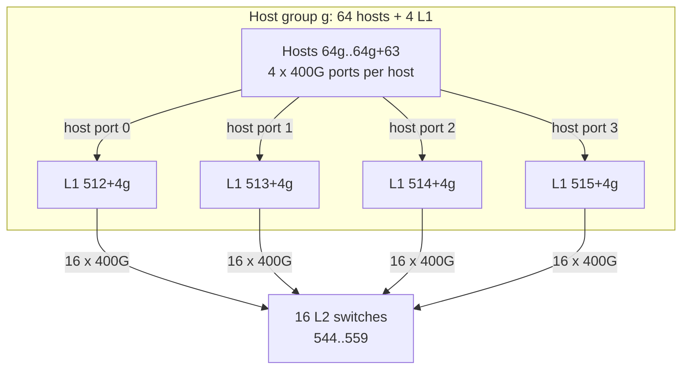

# 拓扑定义

## 逻辑结构

测试使用一个对称的两级 Clos：

- 512 台主机，节点 ID `0..511`；
- 每台主机 4 个 400 Gbps 端口；
- 32 台 L1 交换机，节点 ID `512..543`；
- 16 台 L2 交换机，节点 ID `544..559`；
- 8 个 host group，每组包含 64 台主机和 4 台 L1；
- 组内每台主机的端口 `0/1/2/3` 分别连接该组的 4 台 L1；
- 每台 L1 与全部 16 台 L2 全互联。



## 端口编号

| 节点 | 端口 | 对端 |
|---|---|---|
| Host `h` | `0..3` | 本组第 `0..3` 台 L1 |
| L1 | `0..63` | 本组对应 host |
| L1 | `64..79` | L2 `544..559` |
| L2 | `0..31` | L1 `512..543` |

链路配置：

- Host↔L1：`400Gbps`，`100ns`；
- L1↔L2：`400Gbps`，`250ns`；
- 节点转发延迟：`1ns`；
- 交换机分配周期：`10ns`；
- 固定上游提交不包含额外的 synthetic ingress-contention penalty，等价于不注入该实验延迟。

## 结构不变量

生成器会在写文件前后检查：

- Host degree = 4；
- L1 degree = 80；
- L2 degree = 32；
- Host↔L1 链路 = 2048；
- L1↔L2 链路 = 512；
- 总链路 = 2560；
- 任意 `(nodeId, portId)` 只能出现一次；
- 完整目的节点/目的端口路由共 1,144,832 行。

运行 `python3 scripts/generate_cases.py` 后，拓扑资产位于：

```text
work/cases/_topologies/clos512-4x400g/
├── node.csv
├── topology.csv
└── routing_table.csv
```

各个用例通过硬链接共享同一份拓扑和路由表，避免把 33 MB 路由表复制多次。
